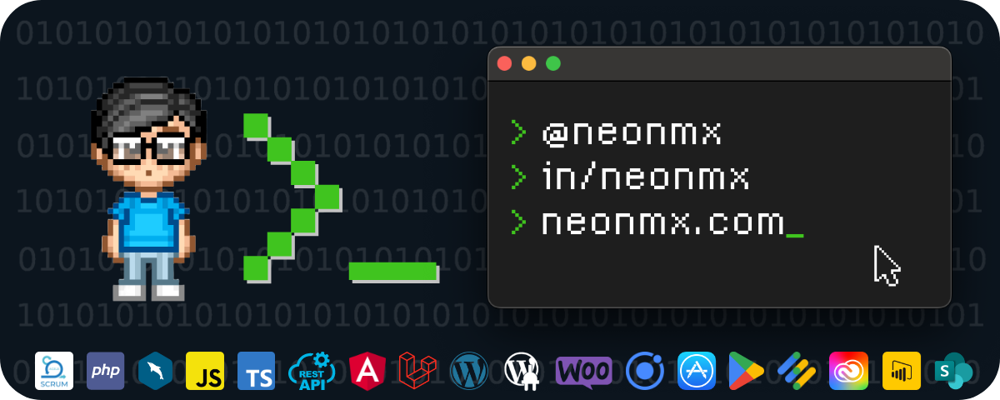

#  Hola, soy Álvaro Martz 👋
### Freelance Fullstack Web/App developer

Desarrollador de proyectos de TI Full Stack centrado en soluciones con más de 18 años de experiencia en el desarrollo y liderazgo de proyectos de tecnología desde el diseño hasta la implementación. Con experiencia en el diseño de herramientas personalizadas, administración y desarrollo de extremo a extremo.

<!--
**neonmx/neonmx** is a ✨ _special_ ✨ repository because its `README.md` (this file) appears on your GitHub profile.

Here are some ideas to get you started:

- 🔭 I’m currently working on ...
- 🌱 I’m currently learning ...
- 👯 I’m looking to collaborate on ...
- 🤔 I’m looking for help with ...
- 💬 Ask me about ...
- 📫 How to reach me: ...
- 😄 Pronouns: ...
- ⚡ Fun fact: ...
-->
